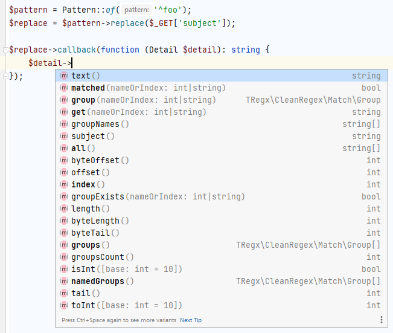

T-Regx is a lightweight, high-level library for regular expressions in PHP. It's designed
to be suitable for simple projects and enterprise solutions.

The name "T-Regx" is a combination of words "Regex" and "T-Rex" (Tyrannosaurus Rex).

Main features of T-Regx are:

- Single-point entry `Pattern` class
- Regular expressions without delimiters (so `Pattern::of("^foo")` instead of `preg_match("/^foo/")`)
- UTF-8 support out of the box
- [Prepared Patterns](prepared-patterns.md) handling unsafe characters (e.g. user input, delicate values)
- Both replacing and matching is with detailed [`Detail`] object
- Uses PHP regular expressions under the hood, but doesn't leak any of its interface or flaws

Surpasses PHP in many ways:
- Doesn't use PHP warning/error/notice/fatal system, uses only exceptions, for example `MalformedPatternException`
- Doesn't use any flags, default arguments or varargs, everything is done with methods
- Doesn't return `false` or `null` on error, but throws a suitable exception instead (for example `NonexistentGroupException`)
- Doesn't return `null` or `""` to indicate an unmatched group, but uses `Group.matched()` and other methods instead

## Example usages of T-Regx

### Example usage of matching

```php
<?php
use TRegx\CleanRegex\Pattern;

/**
 * Instantiate your pattern
 */
$pattern = Pattern::of("^(f)oo");

$matcher = $pattern->match($_GET['input'])

if ($matcher->fails()) {
  die("Nothing matched!");
}

/**
 * @var Detail $detail
 */
foreach ($matcher as $detail) {
  $detail->text();   // matched text
  $detail->offset(); // matched offset in characters, for bytes use byteOffset()
  $detail->get(1);   // get first capturing group
}

echo "Found " . $matcher->count() . " occurrences";

/**
 * @var string[]
 */
$splitElements = $pattern->split($_GET['input']); // split by regular expression
```

When calling multiple methods on the same `$matcher` object, T-Regx doesn't make any unnecessary calls to underlying
PHP implementations.

```php
$match->all();   // calls `preg_match_all()` to return Detail[]
$match->count(); // reuses the return value from the previous PHP call
```

### Example usage of replacing


```php
<?php
use TRegx\CleanRegex\Pattern;

/**
 * Instantiate your pattern
 */
$pattern = Pattern::of("https?://(\w+\.\w+)");

/**
 * Replace all matched occurrences
 */
$replace = $pattern->replace($_GET['input'])

/**
 * Replace with a constant value
 */
$replace->with('XXX'); // censor all links in the input

/**
 * Replace dynamically via callback
 */
$replace->callback(function (Detail $detail): string {
    return 'new';
});

/**
 * Replace with a group reference format
 */
$replace->withReferences('://$1'); // censor links with group reference format
```

### Example usage of splitting

```php
<?php
use TRegx\CleanRegex\Pattern;

/**
 * Match a vertical pipe or a comma
 */
$pattern = Pattern::of('[|,]');

/**
 * Split all occurrences
 */
$elements = $pattern->split($_GET['input']);

/**
 * Split limited occurrences, from the start
 */
[$first, $second, ...$rest] = $pattern->splitStart($_GET['input'], 2);

/**
 * Split limited occurrences, from end
 */
$elements = $pattern->splitEnd($_GET['input'], 2);
```

### Example of prepared patterns

This example illustrates a pattern that allows us to match string enclosed in double quote `"`
or a backtick `` ` ``, for example `"foo"` or `` `foo` ``, but not ``"foo` `` and not `` `foo"``.

Additionally, we want the word to be anything we want, including data that potentially holds
special regular expression values.

```php
<?php
use TRegx\CleanRegex\Pattern;

$word = "my.word"; // we want the period to be treated literally

/**
 * Inject the value into @ placeholder in the pattern 
 */
$pattern = Pattern::inject('(["`])@\1', [$word]);

$patter->test('content with "my.word"'); // bool (true)
$patter->test('content with "my!word"'); // bool (false)
```

Method `Pattern.test()` returns `true` if, and only if a pattern matches the given subject. In this example,
we can see that despite the dot character used in `"my.word"`, the subject `'content with "my!word"'` isn't matched.

That's because prepared patterns (such as patterns created with `Pattern::inject()`) treat each value literally, 
not as regular expression special characters.

You can read more about prepared patterns in [Handling user input].

### Code completion with IDE

Because `Pattern` is designed with methods and objects, IDE suggestions can be very helpful when developing applications
with `Pattern`. Proper suggestions from IDE reduce time spent of reading documentations and finding the correct
syntax or notation.



## Error handling in T-Regx

### Examples of a missing group 

```php
<?php
use TRegx\CleanRegex\Pattern;

/**
 * Pattern with only one capturing group 
 */
$pattern = Pattern::of('(Foo)Bar');

/**
 * Create matcher for a given subject
 */
$matcher = $pattern->match('FooBar');

/**
 * Perform one match on the subject
 */
$firstDetail = $matcher->first();

/**
 * Try and read a second group 
 */
try {
  $firstDetail->get(2);
} catch (NonexistentGroupException $exception) {
  echo "There is no such group";
}
```

### Examples of error handling in T-Regx

T-Regx doesn't interfere with userspace in any way. After using `Pattern` or `Matcher` with pattern
or subject which can't be matched because of malformed unicode encoding, or perhaps because of
catastrophic backtracking, a suitable exception will be thrown, but the userspace will be left intact,
so calling `preg_last_error()` won't return errors.

```php
<?php
use TRegx\CleanRegex\Pattern;

/**
 * Pattern with only one capturing group 
 */
$pattern = Pattern::of('(Foo)Bar', 'u');

$invalidUnicodeSubject = "\xc3\x28";

try {
  $matcher = $pattern->match($invalidUnicodeSubject)->first();
} catch (SubjectEncodingException $exception) {
  echo "There is a unicode encoding error in the subject";
}

preg_last_error(); // `PREG_NO_ERROR`
```

T-Regx **doesn't** override error handlers or exception handlers, since that could greatly pollute userspace
and render the client application less reliable.


[`Detail`]: match.mdx
[`preg_match()`]: https://www.php.net/manual/en/function.preg-match.php
[`preg_replace()`]: https://www.php.net/manual/en/function.preg-replace.php
[`preg_split()`]: https://www.php.net/manual/en/function.preg-split.php
[`pattern()`]: /docs/introduction#entry-points
[Handling user input]: /docs/handling-user-input
